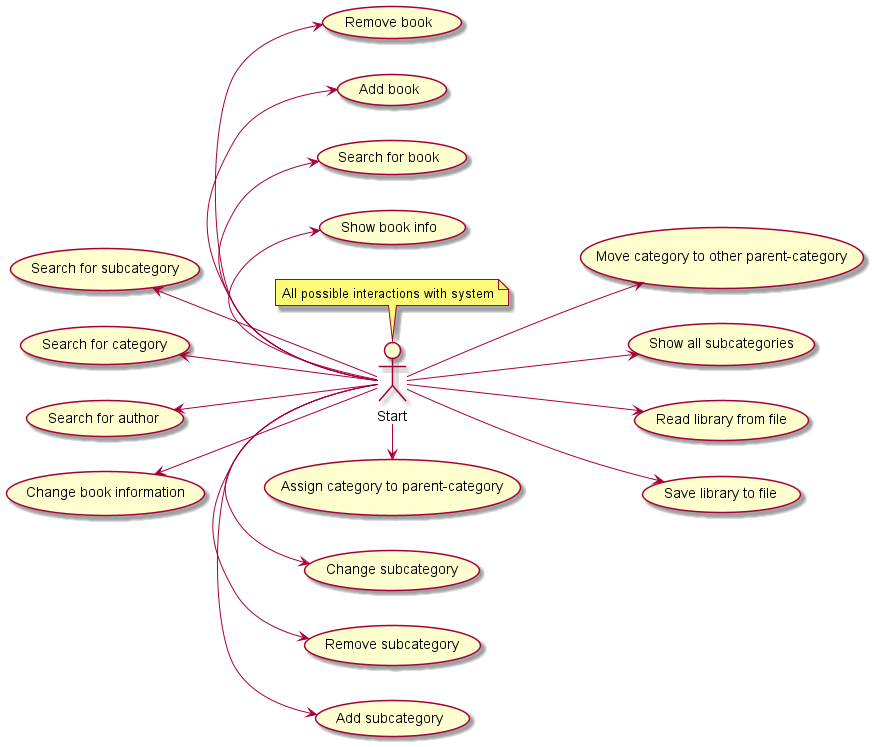
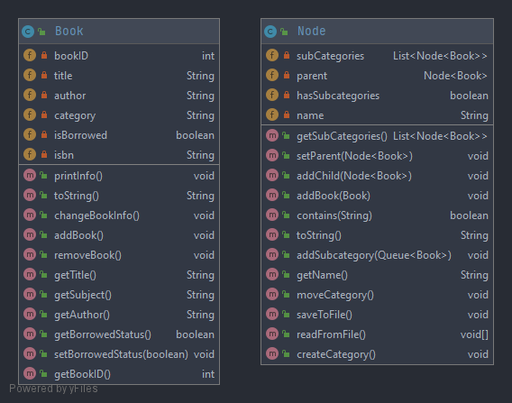

# Etap 1 Projektu
## Członkowie: Kamil Drzewiecki, Jakub Haczyński, Karol Grabowski
## Wybrany projekt: System biblioteczny

## Opis słowny przypadków użycia
- Wyświetlenie informacji o książce
- Dodanie książki
- Usunięcie książki
- Zmiana informacji o książce
- Wyszukanie książki
- Wyszukanie Autora
- Wyszukanie kategorii
- Wyszukanie podkategorii
- Dodanie podkategorii
- Usunięcie podkategorii
- Zmiana podkategorii
- Przypisanie kategorii do kategorii-matki
- Wyświetlenie wszystkich podkategorii
- Zapisanie biblioteki do pliku  
- Odczyt biblioteki z pliku
- Przeniesienie kategorii do innej kategorii-matki
## Diagram przypadków użycia

## Diagram klas

## Repozytorium
https://gitlab-stud.elka.pw.edu.pl/kdrzewi1/prm2t21lpro_drzewiecki

